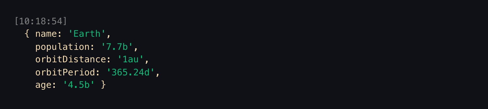

<h1 align="center">Welcome to jot 👋</h1>

<p>
  <a href="https://www.npmjs.com/package/jot" target="_blank">
    
  </a>
  <a href="https://www.npmjs.com/package/jot" target="_blank">
    
  </a>
</p>
<p>
  <a href="https://www.npmjs.com/package/jot" target="_blank">
    
  </a>
  <a href="https://github.com/55Cancri/jotsy#readme" target="_blank">
    
  </a>
  <a href="https://github.com/55Cancri/jotsy/graphs/commit-activity" target="_blank">
    
  </a>
</p>

> Print cleaner, colorful logs to console.

<br />
<div align="center">
  <blockquote class="imgur-embed-pub" lang="en" data-id="a/07I0rCJ" data-context="false" ><a href="//imgur.com/a/07I0rCJ"></a></blockquote><script async src="//s.imgur.com/min/embed.js" charset="utf-8"></script>
</div>

### 🏠 [Homepage](https://github.com/55Cancri/jotsy#readme)

## Description

Clean, simple, logging utility. Jot adds color and minimalism to your logs and errors.

<br />
<br />
<br />

## Install

### NPM

```sh
npm i jotsy
```

### Yarn

```sh
yarn add jotsy
```

## Usage

Jot just works out of the box.

```typescript
import jot from 'jotsy'

jot.log('Life is just an 80 or so year interruption from the void. --Nuziburt')
```

<br />
<div align="center">
  
</div>
<br />
<br />
<br />

You can change the color of the text.

```typescript
import jot from 'jotsy'

jot.log(
  'High self-awareness means that when you look in the mirror, you see yourself as you are—a flawed thinker with endless potential to learn. --Tim Urban',
  { textColor: 'springgreen' }
)
```

<br />
<div align="center">
  
</div>
<br />
<br />
<br />

Or the color of the timestamp.

```typescript
import jot from 'jotsy'

jot.log(
  "Stay determined——not impatient nor discouraged——and with repeated trial and error, you're bound to reach a splendid outcome eventually. --Koro Sensei",
  { timestampColor: 'dodgerblue' }
)
```

<br />
<div align="center">
  
</div>
<br />
<br />
<br />

Or how about no timestamp at all?

```typescript
import jot from 'jotsy'

jot.log(
  'I always knew that looking back on the tears would make me laugh. But I never knew looking back on the laughs would make me cry.  --The Office',
  { showTimestamp: false, textColor: 'mediumpurple' }
)
```

<br />
<div align="center">
  
</div>
<br />
<br />
<br />

Objects and arrays print the entire contents.

```typescript
import jot from 'jotsy'

const planet = {
  name: 'Earth',
  population: '7.7b',
  orbitDistance: '1au',
  orbitPeriod: '365.24d',
  age: '4.5b'
}

jot.log(planet, { textColor: 'wheat' })
```

<br />
<div align="center">
  
</div>
<br />
<br />
<br />

## Author

👤 **Eric Morrison**

- Github: [@55Cancri](https://github.com/55Cancri)

## 🤝 Contributing

Contributions, issues and feature requests are welcome!<br />Feel free to check [issues page](https://github.com/55Cancri/jotsy/issues). You can also take a look at the [contributing guide](https://github.com/55Cancri/jotsy/blob/master/CONTRIBUTING.md).

## Show your support

Give a ⭐️ if this project helped you!

## 📝 License

Copyright © 2020 [Eric Morrison](https://github.com/55Cancri).<br />
This project is [MIT](https://github.com/55Cancri/jotsy/blob/master/LICENSE) licensed.
